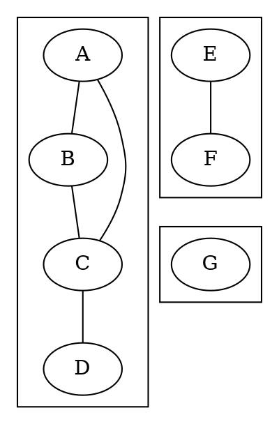
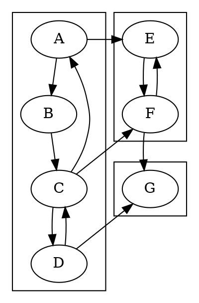
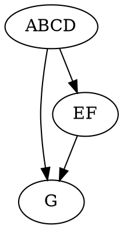

## Undirected Graphs

We say that an undirected graph is **connected** if there is a path connecting any pair of edges.
More generally, we can partition any undirected graph into a set of **connected components**, where each component is a connected subgraph and there are no edges between components.
The picture you should have is of dividing the graph into "islands": within each island all nodes are reachable from each other, but there are no bridges going between the islands.

_Example of an undirected graph with three connected components_

Identifying the connected components of an undirected graph is easy: perform a traversal (either DFS or BFS) starting from any node, and you will visit exactly the nodes within the component containing the starting point.
If every node is reachable from the chosen start, then the graph is connected.
Otherwise, choose a new starting point from the unvisited nodes and repeat to find the other components.

## Directed Graphs

When dealing with directed graphs, several versions of connectedness have been studied.
We will look at the notion of being **strongly connected**, which means that for any pair of nodes $A$ and $B$, there are paths both from $A$ to $B$ and _also_ from $B$ to $A$.
Equivalently, we can say that every node in a strongly connected graph is **reachable** from every other node.
Again, even if a directed graph is not strongly connected, we can split it up into a collection of **strongly connected components**.
Unlike the case for connected components in an undirected graph, we may have some bridging edges between distinct strongly connected components; however, they must only connect in one direction, or else they could be used to connect nodes back and forth between the components, contradicting the claim that the components are distinct.

_Example of a directed graph with three strongly connected components_

### The Meta-Graph

Within a single strongly connected component, we may freely move between nodes.
If there is more than one node in a component, then they will all be part of a cycle.
However, there can be no cycles that involve more than a single component, because that would imply a path leading from one component to another and back again.
The **meta-graph** of a (directed) graph can be extracted by mapping all of the nodes of each component into a **supervertex**, with edges between supervertices exactly when there is an edge from some node in one component to some node in the other.
For example, in the graph shown above, the supervertices will be $ABCD$, $EF$, and $G$, and the edges will be $ABCD\longrightarrow EF$, $ABCD\longrightarrow G$, and $EF\longrightarrow G$.
Since there are no cycles between the strongly connected components, the meta-graph will always be a DAG, and its nodes can be put in a topological order.

_The meta-graph of the above example_

This gives a useful "two level" view of a graph, with a local structure within each component (all nodes being mutually reachable) and a global structure between components.
For example, when the edges of a directed graph represent dependencies, the local structure reveals the interdependencies, while the global structure provides an ordering ("do all of the tasks in this component before the tasks in that component").

If you take the transitive closure of a graph (considered as a relation), then there will be an edge from $A$ to $B$ exactly when there is a path from $A$ to $B$ in the original graph.
Each strongly connected component in this closure graph will be a **clique**&mdash;a cluster of nodes with all possible interconnections.
The supervertices in its meta-graph will form a **strict partial order**&mdash;an irreflexive, asymmetric, transitive relation (this is essentially an ordinary partial order with all of the self-loops removed, just like the difference between "strictly less than" ($<$) and "less than or equal" ($\leq$)).

### Kosaraju's Algorithm

We may find the strongly connected components of a graph in linear time using two passes of depth-first search.
This is known as **Kosaraju's Algorithm**, or sometimes the **Kosaraju-Sharir Algorithm** (Kosaraju discovered it in 1978, but didn't publish it before Sharir independently discovered it in 1981).

Considering the meta-graph of a graph, there must be at least one strongly connected component that is a **sink**&mdash;that is, with no edges leaving it.
To see this, simply take the last component in any topological ordering of the meta-graph; it cannot have any edges leading to another component, because that would contradict the definition of a topological order.
If we were to start a DFS traversal in such a sink component, then it would visit exactly the set of nodes within that component (because those are exactly the nodes reachable from anywhere in the component).
After processing a sink, if there are any unvisited components then the meta-graph of all of the remaining components must again have at least one sink (in terms of the full graph, the new sink might have outgoing edges, but they will only go to already visited nodes).
Restarting the DFS traversal at an arbitrary node in this new sink component will then visit exactly the nodes in that component, because we do not follow edges that lead to already visited nodes.
This process of restarting DFS in successive remaining sink components will eventually visit all of the components, in a reverse topological order.

The issue then is to identify a node in a sink component.
However, this is not as simple as choosing the first node to be finished in a depth-first search!
For example, in the graph above, if we were to start at node $C$ and then visit $A$ and $B$ in turn, then we would finish $B$ right away, even though it is not in a sink component (which in the example would be only node $G$).

On the other hand, it is easy to use DFS to identify a node in a **source** component&mdash;that is, in a component with _only_ outgoing edges.
After completing a DFS traversal of the entire graph (including any necessary restarts), the very last node to be finished is guaranteed to be in a source component, because none of the nodes in a source can be marked finished before any of the rest of the graph.
Although we cannot say that the DFS traversal has found a topological ordering of the entire graph, because such an ordering will not exist if there are cycles, we can say that the last-finished node may only have incoming edges from other nodes in the same (source) component.

Now, we have seen that it is easy to identify a node in a _source_ component, but we know how to pick off the components if we can start in a _sink_.
The remaining key observation is that the **reverse** of a directed graph, which has the same set of nodes but all of the edges are reversed, must have the same set of strongly connected components; furthermore, a source component in the original graph will be a sink component in the reverse graph!

Finally, we can combine the above observations to obtain Kosaraju's algorithm:

* First perform a DFS traversal of the entire graph to yield a list of the nodes in reverse-finishing order (that is, the first node on the list will be the last one marked finished);

* Then step through that list of nodes in order, using each unvisited node to start a DFS traversal on the _reverse_ graph. This will visit exactly the nodes in the next (in topological order) strongly connected component, because in terms of the reverse graph we are repeatedly restarting in the next remaining sink.

Since this requires a total of two DFS passes over all of the nodes in the graph, the running time will be linear in the size of the graph (number of nodes plus edges).

## Exercises

1. Trace through Kosaraju's algorithm on the sample graph above and verify that it visits $A$, $B$, $C$, and $D$ before needing to be restarted, then it visits $E$ and $F$, and finally visits $G$ on the last restart.
(Within each component, it will not necessarily go in alphabetical order.)
